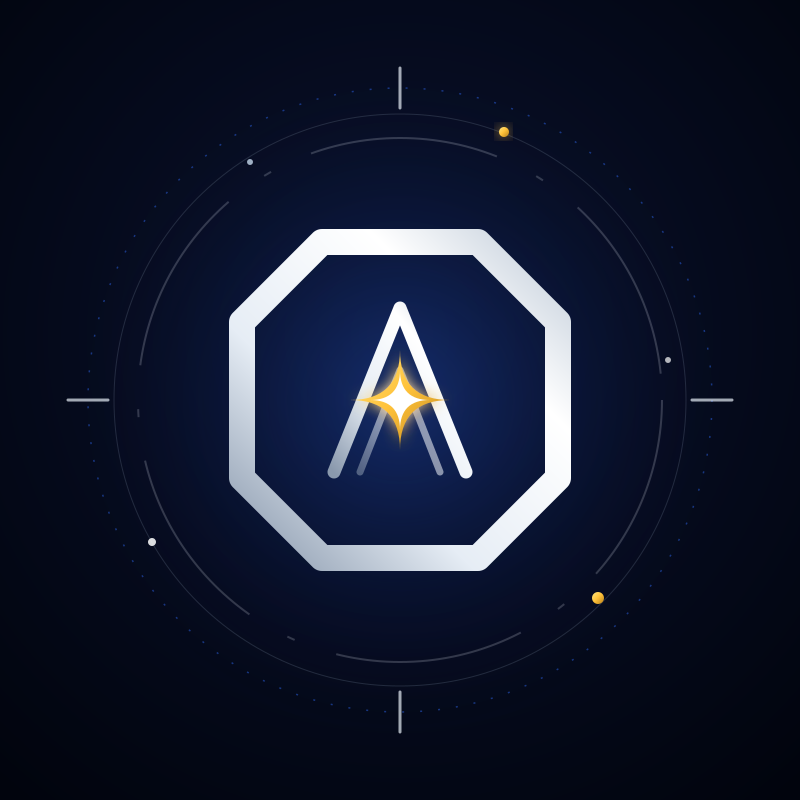
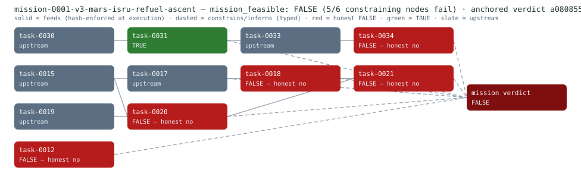
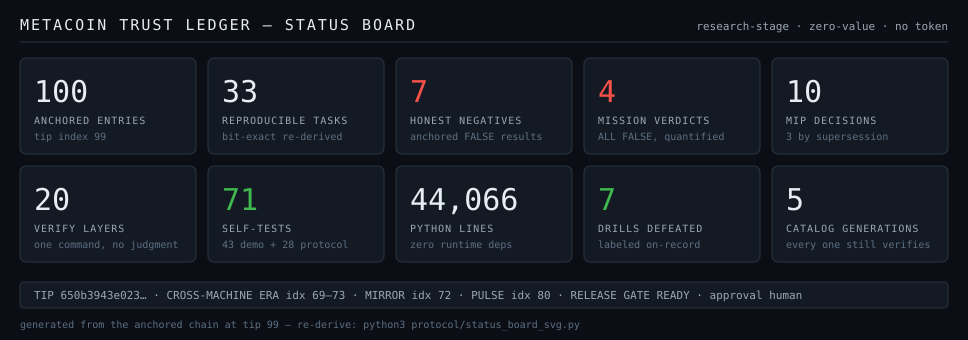

<p align="center">
  
</p>

<h1 align="center">MetaCoin</h1>

<p align="center">
  <strong>The credibly neutral money-and-work protocol for the Space Machine Economy.</strong><br>
  <em>Money for machines building the stars.</em>
</p>

<p align="center">
  <a href="https://github.com/MetacoinLab/metacoin/actions"></a>
  
  
  
  <br>
  
  
  
</p>

> MetaCoin is a credibly neutral, fair-launch base currency for the Space Machine Economy: minted only through objective, programmatic, hard-to-fake infrastructure work — while a separate, fee-funded MetaStar Treasury pays humans, AI agents, and bounded-autonomous robots to build the software, energy, robotics, and research primitives of the space economy.

> Gold was the money of the old world. Bitcoin became the money of the digital world. MetaCoin is *designed* to become the work-and-energy currency of the Space Machine Economy.

---

<!--era-pin:entry_count=108 tip_hash_prefix=0e161cc80291-->
> **Protocol state as of ledger entry <!--era:entry_count-->108<!--/era--> (tip index <!--era:tip_index-->107<!--/era-->, hash `<!--era:tip_hash_prefix-->0e161cc80291<!--/era-->…`).** Every tagged number in this README hangs off that declared chain point, and `protocol/doc_verify.py` re-checks each one against the chain at that point on every CI run. This README is pinned to ledger entry <!--era:entry_count-->108<!--/era-->; the chain and [`docs/`](docs/) carry live state.

---

## The headline artifact: a public claim, decomposed and verified

On 2026-08-30 a widely shared public post ([the post](https://x.com/elonmusk/status/2093965014889566230), recorded verbatim on-chain with author and timestamp) asserted that satellites launched by mass drivers on the Moon to the Earth–Sun Lagrange points can solve global warming for about a billion years. This repository decomposed that claim into **8 reproducible tasks over pinned, hash-verified constants** (idx 83–90: required flux fraction → shade area → mass → lunar aluminum → launch energy → deployment cadence → dust variant → billion-year horizon) and anchored a mission-level verdict — **`mission_feasible: FALSE`** (idx 91 <!--idx:91=mission_verdict_recorded-->). Two constraints fail, quantified: deployment at the claim's stated cadence takes **187 years against a 50-year climate-relevant horizon (3.74× over)**, and the dust-cloud variant fails on its own physics — **a dust cloud at L1 ten-folds its spread in 52.9 days** (derived e-folding 23.0 days) against a one-year minimum useful persistence. One constraint passes, conditionally: the **billion-year horizon honestly survives** solar-brightening arithmetic (computed ceiling 1.02 Gyr), conditional on growing the shade ~8.6× over that horizon — a 2.5% margin, published with its own sensitivity. A companion **feasibility envelope** (idx 92 <!--idx:92=mission_envelope_recorded-->) states what would flip it, labeled verbatim *"engineered scenario: the parameter set under which the claim becomes feasible — not a claim about present capability"*: four mass drivers each firing ~129× the largest demonstrated electromagnetic-launcher shot energy once a minute — while the film-density lever has **no flip at all** (a lighter sail defeats itself by geometry, not manufacturing).

The same machinery holds an **11-node Mars mission chain** — Earth–Mars transfer window → arrival/capture → entry-descent-landing → ISRU propellant chain → ascent, every edge either hash-enforced at execution time or typed and declared — and its verdict is also **FALSE** (idx 82 <!--idx:82=mission_verdict_recorded--> → idx 96 <!--idx:96=mission_verdict_recorded--> → idx 99 <!--idx:99=mission_verdict_recorded-->, each extension superseding the last on-chain while the superseded record still re-derives bit-exact). Five bottlenecks, quantified on the record: the mission-relevant heavy-lander class reaches the parachute gate at **Mach 14.5 against a qualification ceiling near Mach 2**; Sabatier equilibrium conversion computes **0.81 against the 0.92 the budget assumed**; the ascent budget falls short by **2,489 m/s** (2,689 m/s after the equilibrium correction propagates); and the X-band link margin closes at **−1.6 dB**. The transfer window itself honestly **passes** — a launch-period solution derived from a pinned JPL DE440s ephemeris read by a pure-stdlib Chebyshev reader.

## The mission DAG, drawn from the anchored verdict

<p align="center"></p>

The diagram is **generated, not drawn**: `python3 protocol/mission_graph_svg.py` (standard library only) reads the anchored verdict's evidence file and renders it — node colors come from the anchored node verdicts, never recomputed; solid edges are data-enforced (the child recomputes its parent's hash live and refuses drifted input), dashed edges are declared typing. Output is byte-deterministic and self-tested (XML-parses; every anchored node and edge drawn exactly once; the honest FALSEs counted in red; an unanchored mission refused by name).

## Why this is different

- **Bit-exact re-derivation is the only acceptance rule.** Every task emits canonical JSON (sorted keys, ASCII, sign-of-zero-free) and is accepted only when a re-run reproduces its SHA-256 to the digit — <!--era:recorded_task_count-->39<!--/era--> tasks and <!--era:mission_verdict_count-->4<!--/era--> mission verdicts re-derive this way on every full verification, with no LLM or human judgment anywhere in the loop.
- **Honest negatives are first-class results.** 9 of the 39 tasks exist to prove a NO and anchor it: the Mars link budget (task-0012), the ascent budget and its corrected form (0018, 0021), Sabatier equilibrium conversion (0020), sunshade deployment cadence (0027), the L1 dust cloud (0028), heavy-lander EDL (0034), and two from the software/data transfer family — a schema migration whose uniqueness invariant cannot survive (0035) and a test-coverage target honestly not met (0040). They are kept, cited, and drawn in red above.
- **The negative-zero incident, in three lines.** A second machine's re-derivation exposed IEEE-754 negative zeros in canonical artifacts. The fix was a chain-wide canonical-form era transition (idx 67 <!--idx:67=task_hash_era_recorded-->) plus an append-only correction (idx 68 <!--idx:68=anchored_record_correction-->) — no record was rewritten, and the era-1 hashes still verify.
- **The protocol measures its own centralization.** Same-operator concentration is quantified, anchored, and tracked: the frozen baseline measured pairwise ACI <!--era:baseline_pairwise_aci-->0.99365<!--/era--> over <!--era:baseline_path_count-->28<!--/era--> verification paths; the latest anchored epoch measures <!--era:epoch_pairwise_aci-->0.998508<!--/era--> over <!--era:epoch_path_count-->66<!--/era--> — rising toward 1 exactly as expected when one operator accumulates paths, which is what the record says.
- **The abstention probe transfers beyond physics.** Six deterministic software/data-engineering tasks (schema migration, API-contract satisfiability, dependency resolution, configuration audit, pipeline reconciliation, test-coverage gap) are built under the same task law, scored by the same bit-exact rule, and anchored in the same record class (idx 101–107) — and the baseline harness catches a manufactured success on a software task by the identical detector that catches it on a link budget. The claim and its limits are stated in [`docs/TRANSFER.md`](docs/TRANSFER.md).
- **Mistakes are anchored, not erased.** The coordinator has corrected itself twice on the record — the negative-zero repair (idx 68) and a claim-source correction replacing a paraphrase with the verified verbatim post and URL (idx 93 <!--idx:93=anchored_record_correction-->) — both append-only, both leaving the original record in place and re-derivable.

## Quick start

```bash
pip install git+https://github.com/MetacoinLab/metacoin   # or: clone and use python3 directly

metacoin verify                                  # re-derive all 20 layers (~minutes); zero judgment, hashes only
python3 protocol/mission_graph_svg.py --selftest # the diagram above, proven deterministic
metacoin participate                             # the six-rung participant path
```

The full verification corpus ships inside the package — a pip-installed `metacoin` verifies from an empty directory, and a CI cold-install test enforces it. The 15-minute guided walk is [`docs/TOUR.md`](docs/TOUR.md).

The task library is published as a Hugging Face dataset: [metacoin-lab/metacoin-tasks](https://huggingface.co/datasets/metacoin-lab/metacoin-tasks) — **39 tasks as published, in sync with the repository's 39**. The sync is automated: a CI workflow rebuilds the package from the anchored record on every push and publishes a new version only when the task count or a task hash changes (a minor bump on count, a patch bump on hash, otherwise a logged skip); its `verify_tasks.py` re-derives every published hash against the anchored record.

## By the numbers

<p align="center"></p>

The board is generated, not drawn: `python3 protocol/status_board_svg.py` renders it from the same sources `doc_verify` checks, and its self-test asserts tile-by-tile that the board equals those values — the table below carries the same numbers as verifiable text. Chain-derived cells are era tokens, mechanically re-checked against the pinned chain point on every CI run; repo-derived cells are stated as measured at the pin commit.

| Fact | Value |
|---|---|
| Anchored ledger entries | <!--era:entry_count-->108<!--/era--> (tip index <!--era:tip_index-->107<!--/era-->, publicly anchored) |
| Reproducible tasks (space engineering + the software/data transfer family) | <!--era:recorded_task_count-->39<!--/era--> |
| Honest negatives among them | 9 |
| Mission-level verdicts | <!--era:mission_verdict_count-->4<!--/era--> (every one FALSE, quantified) |
| Anchored MIP decisions | <!--era:mip_decision_count-->10<!--/era--> (3 by declared supersession — amendments are new MIPs) |
| Full-verification layers | 20 (`metacoin verify`) |
| Self-test suites | 49 demo + 28 protocol |
| Python in `protocol/` + `demo/` + the CLI, zero runtime dependencies | 46,817 lines |
| Defeated attack drills on-chain | <!--era:drill_entry_count-->7<!--/era--> drill-labeled entries (replays, forged rotation, forged heartbeat, tampered intake, wrongful grant clawed back) |
| Work-molecule catalog generations | <!--era:catalog_anchor_count-->5<!--/era--> (every generation still verifies byte-for-byte) |
| Cross-machine era | idx 69–73 (a second machine's participation and mirror) |
| Independent mirror attestation | idx 72 <!--idx:72=mirror_attestation_anchored--> (non-coordinator device, fingerprint-decided) |
| Latest anchored pulse | idx 80 <!--idx:80=pulse_recorded--> (full-battery green, on the record) |

## Milestones on the chain

Ordered by ledger index — the chain is the timeline. The fuller record lives in [`CHANGELOG.md`](CHANGELOG.md), keyed the same way.

| Idx range | Milestone | What it establishes |
|---|---|---|
| idx 0–16 | Genesis and the first task era | hash-chained ledger, external verification, batch agent attestation |
| idx 17–27 | Provenance, concentration, trust | molecule catalogs, the anchored ACI baseline, cut certificates, trust vectors with no combined score |
| idx 28–47 | Identity, two-flow, intake | Lamport identity with rotation, treasury + Gate-3 clawback, heartbeat emission, six-rung intake — attack drills defeated on-record |
| idx 48–66 | Second task era and catalog generations | 17-task re-derivations, the concentration epoch series, <!--era:catalog_anchor_count-->5<!--/era--> catalog generations all still verifiable, MIP governance opens |
| idx 67–68 | Canonical-form era transition + first self-correction | a second machine's negative-zero finding fixed chain-wide, append-only; era-1 hashes still verify |
| idx 69–73 | Cross-machine era + independent mirror | participation and mirror attestation from outside the coordinator's fingerprint set |
| idx 74–76 | Task law | MIP-0008/0009/0010 bind every new task module (assertions, bounded loops, unit vocabulary, canonical interface) |
| idx 80 | The first anchored pulse | a re-derivable "the whole stack was green here" record |
| idx 82, idx 96, idx 99 | Mars mission verdicts v1→v3 | FALSE with five quantified bottlenecks; each extension supersedes on-chain while the superseded verdict still re-derives |
| idx 83–93 | The civilization-scale claim | 8 pinned-constant tasks, verdict FALSE, the feasibility envelope, the append-only citation correction |
| idx 94–98 | SPICE + EDL beachheads | a pinned DE440s ephemeris read by a stdlib Chebyshev reader; an EDL budget that finds its honest negative |
| idx 100 | The anchored parameter table | 32 behavior-changing constants in one anchored table; a live constant that drifts from it is refused by name |
| idx 101–107 | The software/data transfer family | six deterministic software/data-engineering tasks with two honest negatives, self-recomputed and batch-attested under the same law: the abstention probe design transfers to software/data tasks |

## What this is not

**No token exists.** No sale, no airdrop, nothing transferable; Test-META is a zero-value testnet placeholder by protocol law (MIP-0001 ¶3, MIP-0002 ¶8) and never mints base supply. **Every entry on the chain is the same operator** on machines under direct control — the concentration series above quantifies exactly that, and a matching hash proves reproducibility, never independence or usefulness. Standing opens, on the record: third-party archival of the evidence corpus, the first unaffiliated participant, and the mission chains' own `not_modeled` lists (station-keeping at L1, guided entry, and the rest — named in each verdict). Task constants come from named public sources — NAIF/JPL kernels, NASA GRC model pages, IAU resolutions, IPCC reports — fetched and hashed or cited by DOI, with access refusals recorded; **no affiliation with or endorsement by any of them**. Licensed under **SML-1.0** (source-available, non-commercial; not an OSI license) — see [`LICENSE.md`](LICENSE.md). Not financial, legal, or engineering advice.

## Links

- [`docs/TOUR.md`](docs/TOUR.md) — run the record yourself, 15 minutes
- [`docs/ARCHITECTURE.md`](docs/ARCHITECTURE.md) — the chain, record by record
- [`docs/VERIFICATION.md`](docs/VERIFICATION.md) · [`docs/TRUST-MODEL.md`](docs/TRUST-MODEL.md) — what a green run proves, and what it deliberately does not
- [`docs/PARTICIPATE.md`](docs/PARTICIPATE.md) · [`docs/COLLABORATE.md`](docs/COLLABORATE.md) — the six-rung intake path
- [`docs/PULSE.md`](docs/PULSE.md) — the anchored heartbeat
- [`CHANGELOG.md`](CHANGELOG.md) — the ledger-native change record, keyed by idx range
- [`integrations/`](integrations/) — Inspect · HAL · baselines · Open MCT console
- [Hugging Face dataset](https://huggingface.co/datasets/metacoin-lab/metacoin-tasks) — the published probe set
- [`WHITEPAPER.md`](WHITEPAPER.md) · [`TOKENOMICS.md`](TOKENOMICS.md) · [`mip/`](mip/) — the design documents (`[SPEC]`, not deployment) and every governance decision
- [`legal/`](legal/) — disclaimers and risk notes

```text
============================================================
 RESEARCH-STAGE SPECIFICATION. NO TOKEN EXISTS. NO AIRDROP.
 NOT INVESTMENT, FINANCIAL, LEGAL, OR ENGINEERING ADVICE.
============================================================
```
