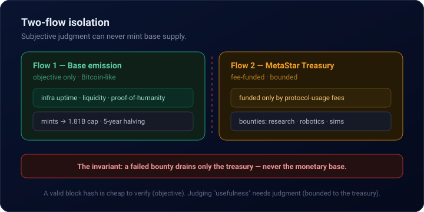
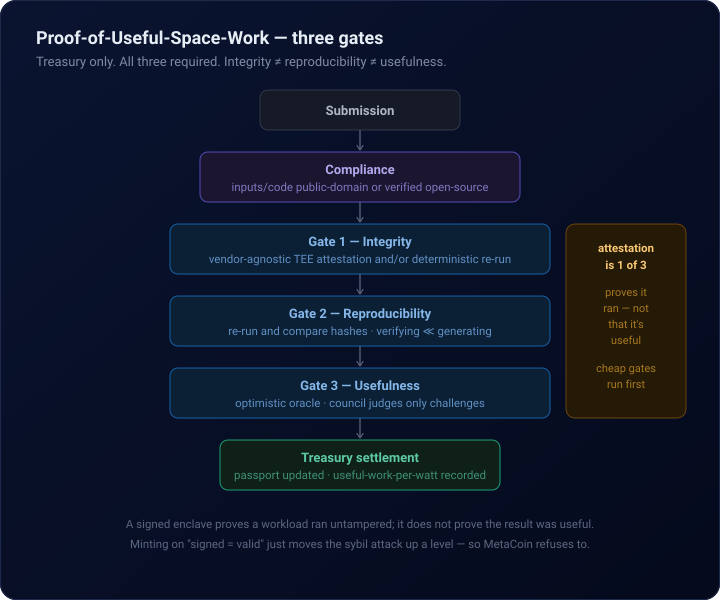

<p align="center">
  
</p>

<h1 align="center">MetaCoin</h1>

<p align="center">
  <strong>The credibly neutral money-and-work protocol for the Space Machine Economy.</strong><br>
  <em>Money for machines building the stars.</em>
</p>

<p align="center">
  <a href="https://github.com/MetacoinLab/metacoin/actions"></a>
  
  
  
  <br>
  
  
  
</p>

> Gold was the money of the old world. Bitcoin became the money of the digital world. MetaCoin is *designed* to become the work-and-energy currency of the Space Machine Economy.

---

## Status

**Research stage. A protocol specification, not a product.** No token, no sale, no airdrop, no investment. Nothing here is financial, legal, or investment advice. See [`legal/`](legal/) and [`LICENSE.md`](LICENSE.md). The repository *is* the project — there is no marketing website.

This README describes two distinct things, and labels which is which:

- **`[SPEC]`** — the designed architecture (the proposal / what MetaCoin is meant to become).
- **`[BUILT]`** — what actually exists and has been mechanically verified in this repository today.

We keep that line sharp on purpose. A design is not a deployment, and we never write the future in the present tense.

---

## One-sentence thesis

> MetaCoin is a credibly neutral, fair-launch base currency for the Space Machine Economy: minted only through objective, programmatic, hard-to-fake infrastructure work — while a separate, fee-funded MetaStar Treasury pays humans, AI agents, and bounded-autonomous robots to build the software, energy, robotics, and research primitives of the space economy.

---

## What makes it different

- **Fair launch.** No founder allocation, no VC, no premine, no hidden reserve, no discretionary minting.
- **Unforgeable base money.** The base currency is *designed* to mint only from objectively verifiable work — infrastructure uptime, on-chain liquidity, proof-of-humanity — never from subjective judgment.
- **A fee-funded mission treasury for the judged work.** Subjective but valuable work (space research, AI-agent reports, robotics bounties, simulations) is paid from the MetaStar Treasury, which is funded only by protocol usage fees — never by minting base supply.
- **Hard money only.** Designed to be referenced against Bitcoin and gold-backed primitives (PAXG/XAUT).
- **Machine-native, for space.** Built around verifiable machine work and energy-constrained autonomous systems, on existing rails (Base / x402-class flows) rather than a new L1.

---

## Architecture `[SPEC]`

### The two-flow isolation

The single most important design decision: base emission and mission grants are strictly separated, so that subjective review can never mint base money.

<p align="center"></p>

Bitcoin mining is objective — any node can cheaply verify a valid block. Deciding whether an AI report is *useful* requires judgment. If that judgment minted base supply, a review committee would become a central bank. So judged work is routed to a bounded treasury instead, where a failed bounty costs only the treasury budget — never the monetary base.

> **Base emission = objective work only. Judged work = treasury bounty only.**

### Supply & emission `[SPEC]`

Designed total supply: **1,810,000,000 META** — one MetaCoin for each mapped star in humanity's great star catalogue. (A design parameter. **No token exists; nothing is minted, sold, or transferable.**)

| Epoch | Years | META released | Cumulative |
|---|---:|---:|---:|
| 1 | 0–5 | 905,000,000 | 50.000% |
| 2 | 5–10 | 452,500,000 | 75.000% |
| 3 | 10–15 | 226,250,000 | 87.500% |
| 4 | 15–20 | 113,125,000 | 93.750% |
| 5 | 20–25 | 56,562,500 | 96.875% |

Designed base-emission channels (objective only, no human judgment in the loop): infrastructure & compute uptime **45%** (cryptographic heartbeats; optional TEE attestation) · BTC/gold liquidity provision **35%** (self-evident on-chain) · proof-of-humanity baseline **20%** (one verified human, one claim). Values marked default, pending confirmation; the *structure* — two-flow separation, no reserve — is the invariant.

### Proof-of-Useful-Space-Work: the three-gate stack `[SPEC]`

> PoUSW governs the **treasury** (Flow 2) — it never mints base supply. It validates judged work through three independent gates, all required for full settlement. The core principle: **integrity ≠ reproducibility ≠ usefulness** — each is verified separately, and cheap gates run first to filter the expensive, subjective gate down to a small surface.

<p align="center"></p>

Hardware attestation is **Gate 1 of 3 — powerful, never alone.** A signed enclave proves a workload ran untampered; it does not prove the result was useful. This is exactly why minting on "signed = valid" only moves the sybil attack up a level — and why MetaCoin refuses to do it.

- **Objective PoUSW** (eligible for base emission): signed node/oracle uptime, liquidity proofs, reproducible compute-job proofs, proof-of-humanity.
- **Subjective PoUSW** (treasury bounty only): AI reports, paper reproduction, robotics design, simulations, tool contributions.

### The data & simulation moat `[SPEC]`

The frontier bottleneck for space robotics is **data** — machines lack first-person space experience, and the answer is simulation and synthetic data. MetaCoin makes reproducible space-robotics simulation and synthetic training data its flagship treasury category, precisely because it uniquely passes Gate 2 *by machine*: high-fidelity simulation, trajectory/kinematics optimization, and synthetic datasets, mapped to the NASA Technology Taxonomy and the ISAM problem set. A **MetaWork Passport** records each actor's verified contribution history; **Useful-Work-per-Watt** is published per submission as a transparency metric — never as an automatic minting trigger (that would reintroduce a gameable printer).

### MetaAgent & bounded robots `[SPEC]`

Agentic payment rails let agents *pay*. MetaCoin defines what useful space-machine work agents should be *paid for*. Every MetaAgent report must carry reproducibility metadata (source hashes, model/version, seed, output hash) or it is ineligible for payment. Robots get **bounded** autonomy — spending caps, allowed-resource sets, a human supervisor key, an emergency pause — never unlimited autonomy. Phases 1–2 use software agents and simulated/terrestrial robotics only; real orbital/lunar deployment is a long-term research direction, not a near-term claim.

---

## What's built & verified `[BUILT]`

Everything in this section exists in the repository and is exercised by CI. Each item is deliberately scoped — these are mechanical, deterministic facts, not marketing.

- **Reproducible task demo** — thirteen reproducible space-engineering tasks spanning NASA-taxonomy domains (orbital mechanics & Lambert transfer, propulsion/Hohmann, robotics/ISAM arm IK, power budget, thermal equilibrium, ballistic re-entry/EDL, deep-space comms & Doppler, comms access windows, rover path planning, rendezvous/docking), wired into a task-agnostic verifier and an earn→verify→spend agent loop. CI 19/19 (demo) + 10/10 (protocol).
- **R1 — Tamper-evident ledger** — an append-only, hash-chained ledger; verification recomputes every hash from content and detects mutation, reordering, insertion, and deletion.
- **R2 — Honest attestation** — software-rooted HMAC attestation, anchored to the ledger. The hardware was investigated and found to have **no usable TPM/TEE**, so the mechanism is honestly labeled *software-rooted, not hardware* — a future hardware/public-key root drops into the same interface.
- **R3 — External verifier + coordinator** — an external party re-derives a task hash; the coordinator anchors the outcome only after **independently recomputing it** (a matching hash proves reproducibility, not who executed the task).
- **Public auditability** — `audit.py` exports a verifiable snapshot, verifies it standalone (no original ledger needed), and commits a tiny public tip anchor — closing the external-anchor gap so anyone can confirm the chain was not silently rewritten.
- **Autonomous agent-verifier** — a published, CI-tested tool that fetches the public snapshot, mechanically re-verifies the chain, checks the tip against the committed anchor, and re-runs the recorded task — **no LLM/AI judgment, hashes and re-runs only.**
- **Cross-platform reproducibility** — the canonical task hash `ff03231f…ba300c` reproduces byte-for-byte on **macOS (arm64)**, **Linux (aarch64)**, **Linux x86-64 (CI)**, and **Windows 11 (AMD64)** — and the CI environment independently re-derives all **thirteen** task hashes against the published snapshot on every push (same-operator; reproducibility evidence, not third-party independence).
- **Full demo↔protocol wiring** — every one of the thirteen tasks is anchored in the tamper-evident ledger: twelve honestly-labeled same-machine self-recompute evaluations plus one batch autonomous-agent attestation covering the entire catalog (Spark-reconfirmed), each record carrying explicit honesty labels (`task_class: illustrative-demo`, topology, zero-value/no-token, limitation notes).
- **Provenance layer — Work Molecules** (`work-molecule/0.2`) — thirteen content-addressed provenance objects, one per task, each assembling the task's spec hash, actors, manifests, execution timestamps, hardware evidence, verification citations, and result hash into a single deterministic document with **three-state field semantics** (populated / asserted-empty / not-captured) and machine-readable **provenance debt**: missing evidence (energy cost, TEE attestation, execution detail) is listed explicitly, never fabricated. The WMID catalog was anchored only after the coordinator independently rebuilt every molecule.
- **Concentration self-measurement** (`aci-report/0.1`) — the protocol measured its **own** agent-concentration baseline: pairwise **ACI 0.99365** over **28 same-operator verification paths** (five evidence dimensions; missing metadata scored worst-case, never as independence) with the multi-scale profile Γ(operator)=Γ(repo)=1.0, Γ(machine)=27/28 — and anchored it. A deliberate, published maximal-concentration starting point: descriptive evidence, never a minting trigger.
- **30-day agent economy demo (simulated time)** — a deterministic earn→verify→spend loop over **30 simulated day indices** (not wall-clock time — nothing ran for 30 real days) rotating through all thirteen tasks: zero-value Test-META is earned only on verified work, spent on simulated compute via the x402 stub, and a **planned day-17 tamper drill** (labeled in-log as a drill, not fraud) proves the rejection path — no earnings, economy continues. Summary (29 verified / 1 drill rejection, 58 earned / 30 spent / 28 final) anchored after the coordinator re-ran the entire simulation and matched the log hash.
- **Provenance debt paydown — compute/energy evidence** (`metering-report/0.1`, `work-molecule/0.3`) — wall-clock and CPU time were **measured** for all thirteen tasks and anchored **append-only** (idx 20); energy is labeled **estimated** (CPU time × an assumed 15 W nameplate figure — no hardware power telemetry exists on this host, and that remains open debt). Timing is non-reproducible by nature, so the anchored `report_hash` fixes the claim made at measurement time, not a recomputable value; the coordinator re-metered every task for plausibility (same output hashes, sane timings) before anchoring. Molecules absorb the evidence as a **new generation** (`work-molecule/0.3`, thirteen new WMIDs, idx 21) with machine-readable **debt_reduction** records that preserve the debt history — while the original 0.2 catalog stays verifiable forever: debt is reduced only by appending evidence, never by modifying a record.
- **Cut certificates** (`cut-certificate/0.1`) — bounded verification of the provenance graph: the coordinator runs the **expensive full proof once, at anchoring** (rebuild every interior molecule, recompute every WMID and the aggregate hash), and every later verifier can **accept cheaply** — one anchored-hash lookup plus a single-molecule retrievability probe — with acceptance explicitly **conditional on the anchor plus continued retrievability** of the molecules (compression, never erasure). The first anchored certificate (idx 22) covers the current **flat** 13-molecule graph — no parent edges exist yet, so it is a degenerate cut exercising the mechanism, and its record says so; non-trivial traversal, boundary computation, and cycle rejection are proven by synthetic self-test fixtures.
- **Trust Vector** (`trust-vector/0.1`) — the per-work evidence vector: **six separately-verified components** per task — integrity (deterministic re-run, software-rooted, no TEE), reproducibility (facts: event counts, statuses, canonical hash), independence (per-work actor count **plus the anchored ACI 0.99365 maximal-concentration baseline**), provenance completeness (counted three-state slots, open debts and debt-reductions listed), usefulness (**honestly empty**: "not-assessed" — Gate 3 does not exist), and verification cost (estimated energy; ρ ≈ 1 stated as trivially uninformative). **No combined score exists, by mechanical rule** — the self-test scans every key for aggregation-shaped names and validation rejects any smuggled scalar. The 13-vector catalog was anchored (idx 23) only after the coordinator independently rebuilt every vector.
- **One-command full-stack verification** — `python3 protocol/verify_everything.py --full` mechanically re-verifies every layer (chain, 13 tasks, both molecule generations, concentration, economy, metering claims, cut certificate, trust vectors) with zero LLM judgment, and is **fresh-clone proven**: the CI self-test copies only git-tracked files to a temp dir and requires a full pass there — every layer's evidence ships in-repo (`protocol/evidence/`, privacy-checked), so a stranger's clone verifies end-to-end with no local-only inputs.

### Current ledger

```text
idx 0      genesis (neutral chain-start marker)
idx 1      external verification — task-0002 reproduced (second machine)
idx 2–3    autonomous-agent attestations — macOS, Windows (Spark-reconfirmed)
idx 4–15   self-recompute evaluations — tasks 0001, 0003–0013
           (honestly labeled same-machine, task_class: illustrative-demo)
idx 16     batch agent attestation — all 13 tasks re-derived & confirmed
idx 17     work-molecule catalog — 13 WMIDs anchored after independent rebuild
idx 18     ACI baseline — self-measured maximal concentration (pairwise ACI 0.99365)
idx 19     30-day simulated-economy summary — 29 verified / 1 planned drill rejection
idx 20     metering evidence — 13 tasks, measured wall/CPU + estimated energy (append-only)
idx 21     work-molecule catalog generation 2 — 13 new 0.3 WMIDs (0.2 catalog stays valid)
idx 22     cut certificate — degenerate flat cut over the 13 molecules (full-proof at anchor)
idx 23     trust-vector catalog — 13 six-component vectors, no combined score by design
public tip anchor: 3f323cff…
```

**Honest boundary.** Every entry so far is the **same operator** on machines under direct control — and the entries now include **same-machine self-recompute** records that are explicitly labeled as adding *no cross-party independence* (this host generated and re-evaluated its own submissions). The anchored concentration baseline **quantifies** that status: pairwise ACI 0.99365 across all 28 verification paths — maximal same-operator concentration, measured and published by the protocol itself. The catalog-wide claim remains **cross-platform reproducibility under one operator** — *not* independent multi-party consensus. The next meaningful milestone is still operational, not code: an unaffiliated third party running the public verifier and submitting a result.

### Verify it yourself

Don't trust — reproduce. One command mechanically re-verifies **every layer** — chain, all thirteen tasks, both molecule-catalog generations, the concentration baseline, the simulated economy, the metering claims, the cut certificate, and the trust vectors — with no LLM/AI judgment anywhere:

```bash
git clone https://github.com/MetacoinLab/metacoin.git
cd metacoin

python3 protocol/verify_everything.py --full     # re-derive everything, ~seconds
python3 protocol/verify_everything.py --quick    # bounded-cost anchored acceptance
```

Every layer's evidence ships in the repo (the published snapshot, the committed tip anchor, and the privacy-checked bundle in `protocol/evidence/`), so a fresh clone verifies completely — the CI self-test proves it by re-running the whole stack from a tracked-files-only copy. Each report line is labeled `VERIFIED-FULL`, `CLAIM-CHECK` (metering: timing is honestly non-reproducible), or `ACCEPTED-BY-ANCHOR` (`--quick`: conditional acceptance, never presented as proof), and the report ends with the honest boundary — what a pass does **not** establish. The layer-by-layer tools remain available (`audit.py --verify`, `agent_verifier.py --verifier-id "$(whoami)-independent"`, and the canonical worked example `ff03231f…ba300c` for task-0002).

### Submit your verification

If you ran the verifier and reached a verdict, you can submit it for anchoring:

1. Run `python3 protocol/agent_verifier.py --verifier-id <your-handle> --out result.json`
2. Open a GitHub Issue titled `Verification result: <your-handle>` and attach or paste `result.json`
3. The coordinator re-derives every claim locally (the same `--anchor-agent-result` path used for all existing entries) and anchors the outcome — match or mismatch — to the public ledger

The first verification from an unaffiliated party will be the project's first cross-party independence record — every entry so far is same-operator, and the ledger says so on each record.

---

## Roadmap

| Phase | Goal | State |
|---|---|---|
| 0 | Constitutional repo — whitepaper, tokenomics, MIP-0001/0002, legal | `[BUILT]` |
| 1 | Agentic testnet — zero-value Test-META, 30-day earn→spend agent demo | `[BUILT]` (simulated days, zero value; summary anchored at idx 19) |
| 2 | Verification engine — the three-gate stack from MIP-0002 | `[SPEC]` |
| 3 | Treasury & first small real grants — milestone-based | `[SPEC]` |
| 4 | Token launch — legal-gated, BTC/gold pairs only | `[SPEC]` |
| 5 | MetaSpace research index — research only, no product without licensed partners | `[SPEC]` |

---

## Repository

- [`WHITEPAPER.md`](WHITEPAPER.md) — full architecture (Master Plan v2.0)
- [`TOKENOMICS.md`](TOKENOMICS.md) — supply, 5-year halving, the two-flow split
- [`ROADMAP.md`](ROADMAP.md) · [`MISSION.md`](MISSION.md) · [`HISTORY.md`](HISTORY.md)
- [`mip/MIP-0001-genesis.md`](mip/MIP-0001-genesis.md) · [`mip/MIP-0002-proof-of-useful-space-work.md`](mip/MIP-0002-proof-of-useful-space-work.md)
- [`protocol/`](protocol/) — ledger, attestation, external & autonomous verifiers, auditability, work-molecule provenance, concentration index
- [`demo/`](demo/) — thirteen reproducible space-engineering tasks + the 30-simulated-day economy demo
- [`legal/`](legal/) — disclaimers and risk notes

## Lineage

The `@MetacoinLab` GitHub organization and the `metacoin.ai` domain were both registered in 2023, when the AI-machine-economy thesis was years ahead of the market. That foresight — not 2023 code — is the lineage. The 2026 work is the execution.

## License

Source-available under the **MetaCoin Sovereign Mission License v1.0 (SML-1.0)** — research, study, and local non-commercial execution are permitted; commercial/mainnet/fundraising use of the code or protected marks requires explicit authorization. SML-1.0 is **not** an OSI open-source license. See [`LICENSE.md`](LICENSE.md).

---

```text
============================================================
 RESEARCH-STAGE SPECIFICATION. NO TOKEN EXISTS. NO AIRDROP.
 NOT INVESTMENT, FINANCIAL, LEGAL, OR ENGINEERING ADVICE.
 The MetaSpace Index is a research/education concept only —
 not an investment product, no securities, no trading access.
============================================================
```
